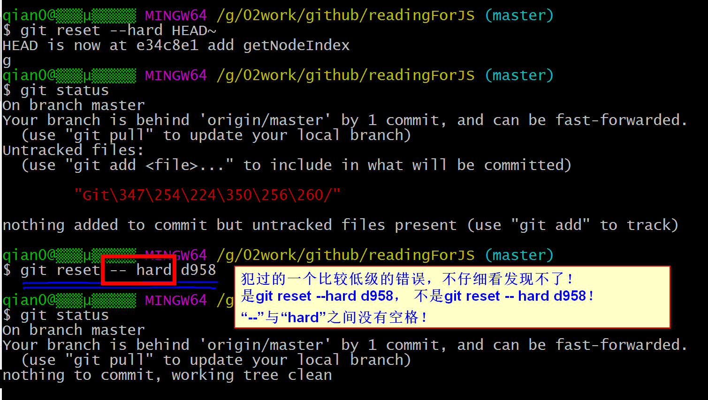

## 一、设置帐号及邮箱
```
$ git config --global user.name "GitHub名称"
$ git config --global user.email "GitHub注册邮箱"

```
注意:

- git config命令的–global参数，表示这台机器上所有的Git仓库都会使用这个配置
- 也可以对某个仓库指定不同的用户名和Email地址。
- 
test为测试文件夹，该文件夹下有一个文件readme.txt

## 二、建立本地仓库，连接远程仓库
```
$ mkdir test
$ cd test
$ pwd
$ git init
$ git add readme.txt(文件名)
$ git commit -m "本次提交的说明"
$ git remote add origin git@github.com:justcode/test.git(远程仓库地址)
$ git push -u origin master //本地库的所有内容推送到远程库（首次推送需要加参数“-u”）
$ git push origin master

$ git clone git@github.com:jstcode/test.git // git clone 仓库地址       Git支持多种协议，包括https，但通过ssh支持的原生git协议速度最快。
```


## 三、常用指令
```
$ git       // 查看系统有没有安装Git
$ cd ..     //回到上一级目录

$ ssh-keygen -t rsa -C "youremail@example.com"      //创建SSH Key
$ git diff      //查看具体修改的内容
$ git log       //显示从最近到最远的提交日志（可以看到版本号commit id) 查看提交历史，以便确定要回退到哪个版本
$ git log --pretty=oneline        //显示从最近到最远的提交日志(简化信息)
$ ls -ah        //查看隐藏文件
$ git status 
```

## 四、版本回退
```
$ git reset --hard HEAD^    //回到上一个版本， HEAD表示当前版本
$ git reset --hard HEAD^^    //回到上上一个版本
$ git reset --hard HEAD~100   //回到往上100个版本
$ git reset --hard 3383939   //回到往上某个版本，版本号可以不写全
$ git reflog    //查看命令历史，以便确定要回到未来的哪个版本
```

比较低级的错误：


## 五、管理修改和撤销修改
```
$ git diff HEAD -- test.txt     //命令可以查看工作区和版本库里面最新版本的区别
$ git checkout -- test.txt      //丢弃工作区的修改: 让这个文件回到最近一次git commit或git add时的状态
git checkout file

$ cat readme.txt      //查看readme文件内容
$ git reset HEAD file   //把暂存区的修改撤销掉（unstage），重新放回工作区 git reset命令既可以回退版本，也可以把暂存区的修改回退到工作区。当我们用HEAD时，表示最新的版本。

```

## 六、删除文件
```
$ rm readme.txt       //删除文件(工作区中的文件)
$ git rm readme.txt   //删除文件（版本库中的文件），删除后记得提交（commit）
$ git checkout -- readme.txt  //把误删的文件恢复到最新版本（用版本库里的版本替换工作区的版本）
```

## 七、分支管理
```
#创建与合并分支
$ git checkout -b dev  //创建dev分支，然后切换到dev分支,（dev为分支名称）  

//git checkout命令加上-b参数表示创建并切换，相当于以下两条命令：
$ git branch dev    // git branch <name> 创建分支
$ git checkout dev  // git checkout <name> 切换分支


$ git branch    //查看当前分支, git branch命令会列出所有分支，当前分支前面会标一个*号。
// dev分支的工作完成，我们就可以切换回master分支  切换回master分支后，再查看一个readme.txt文件，刚才添加的内容不见了！因为那个提交是在dev分支上，而master分支此刻的提交点并没有变：


$ git merge dev     //把dev分支的工作成果合并到master分支上   git merge命令用于合并指定分支到当前分支。git merge <name> 合并某分支到当前分支
$ git branch -d dev //合并完成后，就可以放心地删除dev分支了    git branch -d <name> 删除分支
$ git branch    //删除后，查看branch，就只剩下master分支了
//因为创建、合并和删除分支非常快，所以Git鼓励你使用分支完成某个任务，合并后再删掉分支，这和直接在master分支上工作效果是一样的，但过程更安全。


```

## 八、解决冲突
```
$ git checkout -b feature1
$ git add readme.txt 
$ git commit -m "AND simple"
$ git checkout master
$ git add readme.txt 
$ git commit -m "& simple"
$ git merge feature1
$ git status
$ cat readme.txt
$ git add readme.txt 
$ git commit -m "conflict fixed"
$ git log --graph --pretty=oneline --abbrev-commit
$ git branch -d feature1

//当Git无法自动合并分支时，就必须首先解决冲突。解决冲突后，再提交，合并完成。
//用git log --graph命令可以看到分支合并图。
```

## 九、分支管理策略

通常，合并分支时，如果可能，Git会用Fast forward模式，但这种模式下，删除分支后，会丢掉分支信息。 
如果要强制禁用Fast forward模式，Git就会在merge时生成一个新的commit，这样，从分支历史上就可以看出分支信息。
```
//实战一下--no-ff方式的git merge
$ git checkout -b dev
$ git add readme.txt 
$ git commit -m "add merge"
$ git checkout master
$ git merge --no-ff -m "merge with no-ff" dev
$ git log --graph --pretty=oneline --abbrev-commit
```

在实际开发中，我们应该按照几个基本原则进行分支管理: 
1. master分支应该是非常稳定的，也就是仅用来发布新版本，平时不能在上面干活 
2. 干活都在dev分支上，也就是说，dev分支是不稳定的，到某个时候，比如1.0版本发布时，再把dev分支合并到master上，在master分支发布1.0版本 
3. 合并分支时，加上–no-ff参数就可以用普通模式合并，合并后的历史有分支，能看出来曾经做过合并，而fast forward合并就看不出来曾经做过合并。

主要参考来源：

- <a href="https://www.liaoxuefeng.com/wiki/0013739516305929606dd18361248578c67b8067c8c017b000">廖雪峰 Git教程</a>

## 附录A：使用Git碰到过的问题汇总
1. 
本地误操作导致无法恢复（最近一次的操作有提交），怎么让本地库与远程库保持一致？
解决思路：放弃本地的修改，用远程库覆盖掉本地库。

```
$ git fetch --all
$ git reset --hard origin/master

```

** git fetch 只是下载远程的库的内容，不做任何的合并 **
** git reset 把HEAD指向刚刚下载的最新的版本 **
也可以：重新clone一个远程库到新的目录，但是不想这样做。

- <a href="http://blog.csdn.net/lorkoy/article/details/50404407">git 用远程覆盖本地</a>

- <a href="http://blog.csdn.net/jtracydy/article/details/70402663">git命令-远程仓库拉取、本地仓库更新、工作空间提交等等</a>

发现一张便于理解git操作的图片，如下：
  
2. 修改的代码的话，最好创建一个新的分支并在分支上进行修改，最后合并到master上，不然可能会有大麻烦！（上面的低级错误和第1个问题都可以快速解决）
```

```
3. ...
4. ...

