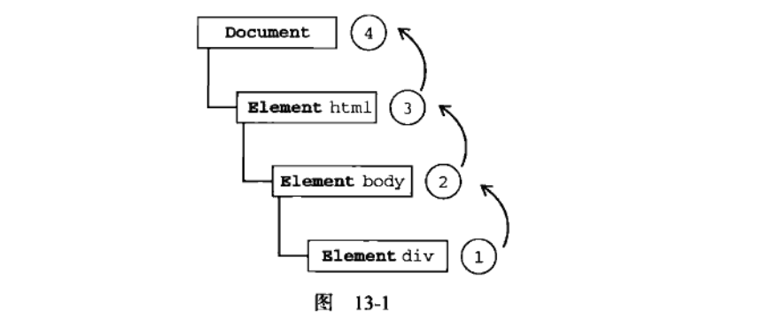
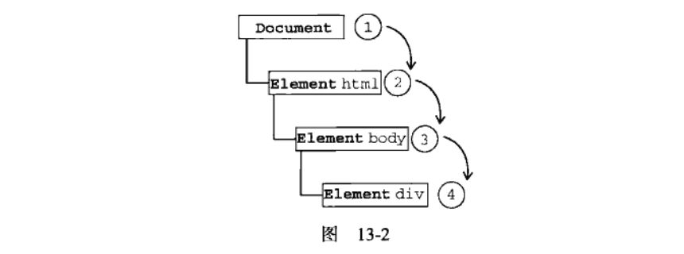
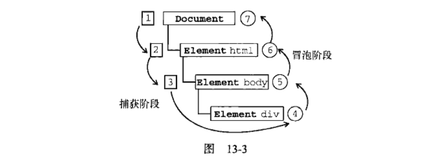
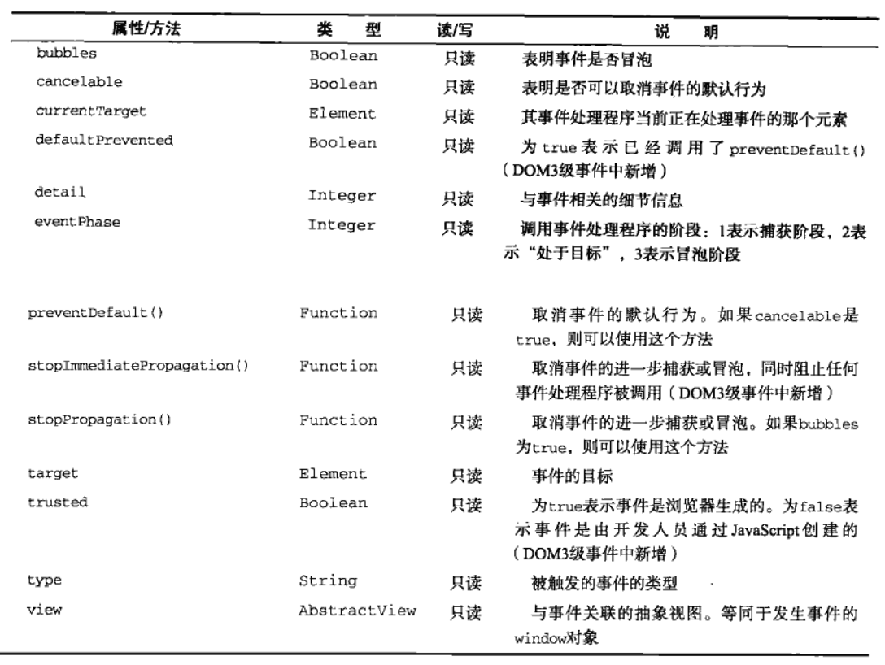
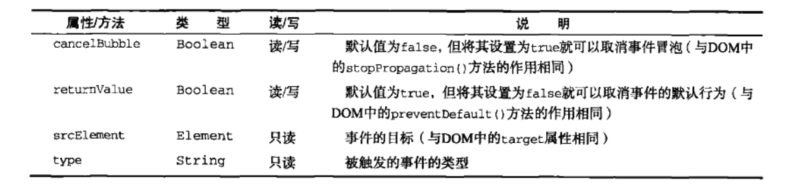

# <a href="javascript:void(0);" id="top">事件</a>

[TOC]

## <a href="javascript:void(0);"  id="layoutH0">相关概念、基础知识</a>
## <a href="javascript:void(0);"  id="layoutH1">13.1 事件流</a>
事件最早在IE3和Netscape Navigator2中出现：用途是**分担服务器运算负载**
**事件流：**描述的是从页面中接收事件的顺序。
IE和Netscape开发团队提出的差不多完全相反的事件流概念：

- IE的事件流是事件冒泡流;
- Netscape Communicator的事件流是事件捕获流。

### 13.1.1 事件冒泡
IE的事件流是**事件冒泡**————即事件开始由**最具体的元素**（文档中嵌套层次最深的那个点）接收，然后逐级向上传播到较为**不具体的点**（文档）。

单击页面中的div，click事件顺序如下：```<div>、<body>、<html>、<document>```.
即click事件先在```<div>```元素上发生，也就是单击的元素；然后click事件沿DOM树向上传播，在每一节点都会发生，直到传播到document对象。

图13-1演示是事件冒泡过程。

所有现代浏览器都支持事件冒泡，但在具体实现上还是有一些差别：

- IE5.5及更早版本中的事件冒泡会跳过<html>元素（从<body>直接跳到document）.
- IE9、Firefox、Chrome和Safari则将事件一直冒泡到window对象.

### 13.1.2 事件捕获
事件捕获具体思想：不太具体的节点应该更早接收到事件，而最具体的节点应该最后接收到事件。
事件捕获用意：事件到达预定目标之前捕获它。

仍以上面页面为例，演示事件捕获，单击页面中的div，
click事件顺序如下：```<document>、<html>、<body>、<div>```.
事件捕获过程中，document对象最先接收到click事件，然后事件沿DOM树依次而下，一直传播到事件的实际目标，即```<div>```元素。

图13-2演示是事件捕获过程。


虽然事件捕获是Netscape Communicator唯一支持的事件流模型，但IE9、Firefox、Chrome、Opera和Safari目前也支持。

尽管“DOM2级事件”规范要求事件应支持document对象开始传播，但这些浏览器都是从window对象开始捕获事件的。
因老版本浏览器不支持，所以很少有人使用事件捕获。（有特殊需求时使用事件捕获）

### 13.1.3 DOM事件流
“DOM2级事件”规定的事件流包括三个阶段：**事件捕获阶段、处于目标阶段、事件冒泡阶段。**

1. 首先发生事件捕获：为截取事件提供机会；
2. 实际目的接收到事件，
3. 最后阶段是冒泡阶段，可以在这个阶段对事件做出响应。

仍以前面HTML页面为例,单击```<div>```元素按图13-3所示顺序触发事件。


在DOM事件流中，实际的目标在捕获阶段不会收到事件。

1. 即在捕获阶段，事件从document到```<html>```再到```<body>```后就停止了，
2. 下一个阶段是“处于目标”阶段，于是事件在```<div>```上发生，并在事件处理中看成冒泡阶段的一部分。
3. 然后冒泡阶段发生，事件又传播回文档。

多数支持DOM事件流的浏览器都实现了一种特定行为：即使“DOM2级事件”规范明确要求捕获阶段不会涉及事件目标，
但IE9、Firefox、Chrome、Safari和Opera9.5及更高版本都会在捕获阶段触发事件对象上的事件。
结果就是有两个机会在目标对象上操作事件。
<a href="13.1.1 事件冒泡.html">事件冒泡机制演示</a>
```
    // 这里是CSS
    * {margin: 0; padding: 0;}
    #box1 {width: 400px; height: 400px; background-color: #ff0000; margin: 40px;}
    #box2 {width: 250px; height: 250px; background-color: #00ff00; margin: 50px;}
    #box3 {width: 100px; height: 100px; background-color: #0000ff; margin: 50px;}

    // 这里是HTML
    <div id="box1">box1
        <div id="box2">box2
            <div id="box3">box3</div>
        </div>
    </div>

    // 这里是JavaScript
    var oBox1 = document.getElementById('box1'),
        oBox2 = document.getElementById('box2'),
        oBox3 = document.getElementById('box3');
    oBox1.onclick = function () {
        alert('box1'); // box1
    }
    oBox2.onclick = function () {
        alert('box2'); // box2 box1
    }
    oBox3.onclick = function () {
        alert('box3'); // box3 box2 box1
    }

```

## <a href="javascript:void(0);"  id="layoutH2">13.2 事件处理程序</a>
<a href="#top" style="font-size: 30px; font-weight: 700; color: #ff0000;">返回顶部</a>
事件：用户或浏览器自身执行的某种动作，如click、load、mouseover，都是事件的名字
而响应某个事件的函数就叫事件处理程序（或事件侦听器）。
事件处理程序的名字以“on”开头，如click事件的事件处理程序就是onclick，load事件的事件处理程序就是onload。

为事件指定处理程序的方式有好几种，如下：

### 13.2.1 HTML事件处理程序
```
<input type="button" value="Click me" onclick="alert('Clicked')" />
```

<a href="13.2 事件处理程序1.html">点击按钮链接</a>

单击按钮，弹出一个警告框。这个操作通过指定onclick特性并将一些JavaScript代码作为它的值来定义。
这个值是JavaScript，因此不能在其中使用未经转义的HTML语法字符，如&/""/</>等。
为避免使用HTML实体，这里用了单引号。如要用双引号，则改成如下形式：

```
<input type="button" value="Click me" onclick="alert(&quot;Clicked&quot;)" />
```
<a href="13.2 事件处理程序1.html">“实体” 点击按钮链接</a>
在HTML中定义的事件处理程序可包含要执行的具体动作，也可调用在页面其它地方定义的脚本。
```
    <input type="button" value="Click me" onclick="showMessage()" />
    <script>    
        function showMessage() {
            alert('Hello world!');
        }
    </script>
```
<a href="13.2 事件处理程序1.html">"调用在页面其它地方定义的脚本"  点击按钮链接</a>
事件处理程序中的代码在执行时，**有权访问全局作用域中的任何代码**。
**这样事件处理程序好处：**

1.创建一个封装着元素属性值的函数，这个函数中有一个局部变量event，即事件对象    

```
<input type="button" value="Click me" onclick="alert(event.type)" />
```


通过event变量，可直接访问事件对象，不用自己定义它，也不用从函数的参数列表中读取。在这个函数内部，**this值等于事件的目标元素**。
2.扩展作用域（with，略）

**在HTML中指定事件处理程序两个缺点**：

1.存在时差问题。因为用户可能会在HTML元素一出现在页面就触发响应事件，但当时的事件处理程序有可能还不具备执行条件。
假设showMessage()函数在页面最下方定义，如用户在页面解析showMessage()函数之前单击按钮就会引发错误。因此很多HTML事件处理程序都会封装在一个try-catch块中，以便错误不会浮出水面。如下：
```
<input type="button" value="Click me" onclick="try{showMessage(); }catch(ex){}" />
```
<a href="13.2 事件处理程序1.html">try-catch  点击按钮链接</a>
这样如在showMessage()函数有定义之前单击了按钮，用户将看不到JavaScript错误。（因为在浏览器有机会处理错误前，错误就被捕获了）。
2.另一个缺点：这样扩展事件处理程序的作用域链在不同的浏览器中会导致不同结果。不同的JavaScript引擎遵循的标识符解析规则略有差异，很可能会在访问非限定对象成员时出错。

3.**HTML与JavaScript紧密耦合**。如要更换事件处理程序，需要改动两个地方：HTML代码和JavaScript代码。

        </script>

        <input type="button" id="btn" value="Clic me" />
        <script>    
            var btn = document.getElementById('btn');
            btn.onclick = function() {
                alert('Clicked');
            };
    </script>

### 13.2.2 DOM0级事件处理程序
通过JavaScript指定事件处理程序的传统方式，**即将一个函数赋值给一个事件处理程序属性**。这种为事件处理过程赋值的方法是在第四代Web浏览器中出现，至今认为所有现代浏览器支持。原因如下：1.简单；2.具有跨浏览器优势
**要使用JavaScript指定事件处理程序，首先要取得一个对操作对象的引用，**

**每个元素（包括window和document）都有自己的事件处理程序属性，这些属性通常全部小写**，如onclick。将这种属性的值设置为一个函数，就可以指定事件处理程序。如下：
```
    <input type="button" id="myBtn" value="Clic me" />
    <script>    
        var btn = document.getElementById('myBtn');
        btn.onclick = function() {
            alert('Clicked');
        };
    </script>
```

在此我们通过文档对象取得了一个按钮的引用，然后为它指定了onclick事件处理程序。
**注意：在这些代码运行以前不会指定事件处理程序，因此如果这些代码在页面中位于按钮后面，就有可能在一段时间内怎么单击都没有反应。**

**使用DOM0级方法指定的事件处理程序被认为是元素的方法**，因此这时的事件处理程序是在**元素的作用域**中运行的，换句话说，程序中的this引用当前元素。如下：
```
    <input type="button" id="myBtn" value="Clic me" />
    <script>    
        var btn = document.getElementById('myBtn');
        btn.onclick = function() {
            alert(this.id);
        };
    </script>
```

<a href="13.2.2 DOM0级事件处理程序1.html">DOM0级事件处理程序 this.id</a>

单击按钮显示的是元素的ID，这个ID是通过this.id取得的。不仅是ID，实际上可以在事件处理程序中通过this访问元素的任何属性和方法。以这种方式添加的事件处理程序会在事件流的冒泡阶段被处理。
也可删除通过DOM0级方法指定的事件处理程序，如下这种方式，将事件处理程序的属性值设置为null即可。
```
    btn.onclick = null // 删除事件处理程序
```
事件处理程序设置为null后，再单击按钮将不会有任何动作发生。
<a href="13.2.2 DOM0级事件处理程序1.html">DOM0级事件处理程序 设置为null后</a>
### 13.2.3 DOM2级事件处理程序
“DOM2级事件”定义了两个方法，用于处理指定和删除事件处理程序的操作：addEventListener()和removeEventListener().所有DOM节点中都包含这两个方法，并且他们都接收3个参数：要处理的事件名、作为事件处理程序的函数和一个布尔值。布尔值为true，表示在捕获阶段调用事件处理程序，为false，表示杂冒泡阶段调用事件处理程序。
        要在按钮上为click事件添加事件处理程序，如下：
```
    var btn = document.getElementById('myBtn');
    btn.addEventListener('click', function() {
        alert(this.id);
    }, false);
```
<a href="13.2.3 DOM2级事件处理程序1.html">DOM2级事件处理程序 </a>
// 上面的代码为一个按钮添加了onclick事件处理程序，而且该事件会在冒泡阶段被触发
与DOM0级一样，这里添加的事件处理程序也是在其依附的元素的作用域中运行。
使用DOM2级方法添加事件处理程序的主要好处是可以添加多个事件处理程序。如下：
```
var btn = document.getElementById('myBtn');
btn.addEventListener('click', function() {
    alert(this.id);
}, false);
btn.addEventListener('click', function() {
    alert('Hello world!');
}, false);  
```
<a href="13.2.3 DOM2级事件处理程序2.html">DOM2级事件处理程序  多个事件</a>
// 这个按钮添加了两个事件处理程序。这两个事件处理程序会按照添加它们的顺序触发，因此首先显示元素的ID，然后显示“Hello world!”消息。

通过addEventListener()添加的事件处理程序只能使用removeEventListener()来移除；移除时传入的参数与添加处理程序时使用的参数相同。这意味着addEventListener()添加的匿名函数将无法移除。如下：
```
    var btn = document.getElementById('myBtn');
    btn.addEventListener('click', function() {
        alert(this.id);
    }, false);
    // ...其它代码
    btn.removeEventListener('click', function() {// 没有用
        alert(this.id);
    }, false);  
```

<a href="13.2.3 DOM2级事件处理程序3.html">DOM2级事件处理程序  无法移除(不是同一个函数）</a>
上面，使用addEventListenear()添加了一个事件处理程序，虽然调用removeEventListener()时，看似使用了相同的参数，但实际上第二个参数与传入addEventListenear()中的第二个是完全不同的参数。但传入removeEventListener()中的事件处理程序必须与传入addEVentListener()中的相同，如下：
```
    var btn = document.getElementById('myBtn');
    var handler = function() {
        alert(this.id);
    }
    btn.addEventListenear('click', handler, false);
    // ...其它代码
    btn.removeEventListener('click', handler, false);
```
<a href="13.2.3 DOM2级事件处理程序4.html">DOM2级事件处理程序  可以移除(是同一个函数）</a>
现在代码没有问题，因为使用了相同的函数。
大多数情况下，都是将事件处理程序添加到事件流的冒泡阶段，这样可以最大限度的兼容各种浏览器。
IE9、Firefox、Chrome、Safari和Opera支持DOM2级事件处理程序


### 13.2.4 IE事件处理程序
IE中实现了与DOM中类似的两个方法：**attachEvent()和detachEvent()**。
这两个方法接受相同的两个参数：事件处理程序名称与事件处理程序函数。
由于**IE8及更早版本只支持事件冒泡**，所以通过attachEvent()添加的事件处理程序都会被添加到冒泡阶段。
要使用attachEvent()为按钮添加一个事件处理程序，如下：
```
    var btn = document.getElementById('myBtn');
    btn.attachEvent('onclick', function() {
        alert('Clicked');
    });
```
<a href="13.2.4 IE事件处理程序1.html">IE事件处理程序 “IE弹出Clicked”</a>
注意：attachEvent()中第一个参数是“onclick”，而非DOM的addEventListener()方法中的“click”。
在**IE中使用attachEvent()**与使用**DOM0级方法**的主要区别：**事件处理程序的作用域**。

- 在使用DOM0级方法的情况下，事件处理程序会在其所属元素的作用域内运行；
- 在使用attachEvent()方法的情况下，事件处理程序会在全局作用域中运行，因此this等于window。

<a href="13.2.4 IE事件处理程序1.html">IE事件处理程序 “this===window为true”</a>

如下：
```
    var btn = document.getElementById('myBtn');
    btn.attachEvent('onclick', function() {
        alert(this === window); // true
    }); 
```
在编写跨浏览器时，牢记这一点区别非常重要！
与addEventListener()方法类似，attachEvent()方法也可用来为一个元素添加多个事件处理程序，如下：
```
    var btn = document.getElementById('myBtn');
    btn.attachEvent('onclick', function() {
        alert('Clicked'); // 后弹出Clicked
    });
    btn.attachEvent('onclick', function() {
        alert('Hello world!'); // 先弹出Hello world!
    }); 
```

<a href="13.2.4 IE事件处理程序2.html">IE事件处理程序 “添加多个事件”</a>

这里调用了两次attachEvent()，为同一个按钮添加了两个不同的事件处理程序。不过与DOM方法不同的是，这些事件处理程序不是以添加它们的顺序执行，而是以相反的顺序被触发。单击这个例子的按钮，首先看到的是'Hello world!'，然后才是'myBtn'。
使用attachEvent()添加的事件可以通过detachEvent()来移除。条件是必须提供相同的参数。与DOM方法一样，这也意味着添加的匿名函数不能被移除，不过，只要能对相同的函数的引用传给detachEvent()，就可以移除相应的事件处理程序。

<a href="13.2.4 IE事件处理程序3.html">IE事件处理程序 “移除相应的事件”</a>

```
    var btn = document.getElementById('myBtn');
    var handler = function() {
        alert('Clicked');
    }
    btn.attachEvent('onclick', handler);
    // ...其它代码
    btn.detachEvent('onclick', handler);
```
支持IE事件处理程序的浏览器有IE和Opera。


### 13.2.5 跨浏览器的事件处理程序
只要恰当的使用能力检测，即可写出跨浏览器的代码。
此处要保证处理事件的代码能在大多数浏览器下一致地运行，只需关注冒泡阶段。
第一个要创建的方法是addHandler()，它的职责是：视情况使用DOM0级方法、DOM2级方法或IE方法来添加事件。这个方法属于一个名叫EventUtil的对象。本书将使用这个对象来处理浏览器间的差异。
addHandler()方法接受三个参数：要操作的元素、事件名称、事件处理程序函数。
与addHandler()方法对应的是removeHandler()，它也接收相同的参数。这个方法的职责：移除之前添加的事件处理程序——————无论该事件处理程序是采取什么方法添加到元素中的，如果其他方法无效，默认采用DOM0级方法。

<a href="13.2.4 IE事件处理程序4.html">IE事件处理程序 “跨浏览器的事件处理程序”</a>

```
        var EventUtil = {
            addHandler: function(ele, type, handler) {
                if(ele.addEventListener) { // DOM2级方法
                    ele.addEventListener(type, handler, false);
                }
                else if(ele.attachEvent) { // IE方法
                    ele.attachEvent('on' + type, handler);
                }
                else { // DOM0级方法
                    ele['on' + type] = handler;
                }
            },
            removeHandler: function(ele, type, handler) {
                if(ele.removeEventListener) { // DOM2级方法
                    ele.removeEventListener(type, handler, false);
                }
                else if(ele.detachEvent) { // IE方法
                    ele.detachEvent('on' + type, handler);
                }
                else { // DOM0级方法
                    ele['on' + type] = null;
                }
            }
        };
```
可以像下面这样使用EventUtil()对象：
```
    var btn = document.getElementById('myBtn');
    var handler = function() {
        alert(this.id);
    }
    EventUtil.addHandler(btn, 'click', handler);
    EventUtil.removeHandler(btn, 'click', handler);
```
存在的问题：addHandler()、removeHandler()没有考虑到所有浏览器，如IE中的作用域问题（不过，使用它们添加和移除事件处理程序还是足够了）；DOM0级对每个事件只支持一个事件处理程序（好在只支持DOM0级的浏览器已经没有那么多了！）


## <a href="javascript:void(0);"  id="layoutH3">13.3 事件对象</a>

<a href="#top" style="font-size: 30px; font-weight: 700; color: #ff0000;">返回顶部</a>

触发DOM上的某个事件时，会产生一个事件对象event,这个对象中包含着所有与事件有关的信息。
包括导致事件的元素、事件的类型以及其它与特定事件相关的信息。
如鼠标操作导致的事件对象中，会包含鼠标位置的信息，而键盘操作导致的事件对象中，会包含鼠标位置的信息，而键盘操作导致的事件对象中，会包含与按下的键有关的信息。
**所有浏览器都支持event对象，但支持方式不同。**

### 13.3.1 DOM中的事件对象
兼容DOM的浏览器会将一个event对象传入到事件处理程序中。无论指定事件处理程序时使用的是什么方法（DOM0级或DOM2级），都会传入event对象。如下：

<a href="13.3.1 DOM中的事件对象1.html">DOM中的事件对象</a>

```
    var btn = document.getElementById('myBtn');
    btn.onclick = function(event) {
        alert(event.type); // click
    };
    btn.addEventListenear('click', function(event) {
        alert(event.type); // click
    }, false);
```

在通过HTML特性指定事件处理程序时，变量event中保存着event对象。如下：
```
<input type="button" value="Click me" onclick="alert(event.type)" />
```

以这种方式提供event对象，可让HTML特性事件处理程序与JavaScript函数执行相同的操作。
event对象包含于创建它的特定事件有关的属性和方法。触发的事件类型不一样，可用的属性和方法也不一样。不过所有事件都会有下表列出的成员。



在事件处理程序内部，**对象this始终等于currentTarget的值，而target则只包含事件的实际目标**。如果直接将事件处理程序指定给了目标元素，则this、currentTarget和target包含相同的值。

<a href="13.3.1 DOM中的事件对象2.html">DOM中的事件对象 currentTarget、target的值</a>

```
    var btn = document.getElementById('myBtn');
    btn.onclick = function(event) {
        alert(event.currentTarget === this); // true
        alert(event.target === this); // true
    };
```

这个例子检测了currentTarget和target与this的值。由于click事件的目标是按钮，因此这三个值是相等的。如果事件处理程序存在于按钮的父节点中（如document.body），那么这些值是不同的。

<a href="13.3.1 DOM中的事件对象3.html">DOM中的事件对象 currentTarget、target的值(事件处理程序存在于按钮的父节点)</a>

```
    document.body.onclick = function(event) {
        alert(event.currentTarget === document.body);// true
        alert(this === document.body);// true
        alert(event.target === document.getElementById('myBtn')); // true
    }
```

单击这个例子中的按钮时，this和currentTarget都等于document.body，因为事件处理程序是注册到这个元素上的。然而target元素却等于按钮元素，因为它是click事件真正的目标。由于按钮上并没有注册事件处理程序，结果click事件就冒泡到了document.body，在那里事件才得到了处理。在需要一个函数处理多个事件时，可以使用type属性。如：

<a href="13.3.1 DOM中的事件对象4.html">DOM中的事件对象 需要一个函数处理多个事件</a>
```
    var btn = document.getElementById('myBtn');
    var handler = function(event) {
        switch(event.type) {
            case 'click':
                alert('Clicked');
                break;
            case 'mouseover':
                event.target.style.backgroundColor = 'red';
                break;
            case 'mouseout':
                event.target.style.backgroundColor = '';
                break;
        }
    };
    btn.onclick = handler;
    btn.onmouseover = handler;
    btn.onmouseout = handler;
```

**阻止特定事件的默认行为，可以使用preventDefault()方法。**如，链接的默认行为就是在被单击时会导航到其href特性指定的URL。如你想阻止链接导航这一默认行为，那么通过链接的onclick实际处理程序可以取消它。如下：

<a href="13.3.1 DOM中的事件对象5 链接.html">DOM中的事件对象 链接</a>
```
    <a href="https://www.baidu.com/" id="myLink">阻止链接跳转</a>
    // ....
    var link = document.getElementById('myLink');
    link.onclick = function(event) {
        event.preventDefault();
    };
```

<a href="13.3.1 DOM中的事件对象6 取消事件传播.html">DOM中的事件对象 立即停止事件在DOM层次中的传播</a>

只有cancelBubble属性设置为true的事件时，才可以使用preventDefault()来取消事件默认行为。

另，stopPropagation()方法用于立即停止事件在DOM层次中的传播，即取消进一步的事件捕获或冒泡。
如直接添加到一个按钮的事件处理程序可以调用stopPropagation()，从而避免触发注册document.body上面的事件处理程序。如下：

```
    var link = document.getElementById('myLink');
    link.onclick = function(event) {
        // event.preventDefault();
        alert('Clicked');
        event.stopPropagation();
    };  
    document.body.onclick = function(event) {
        alert('Body clicked');
    };
```

对这个例子而言，如果不调用stopPropagation()，就会在单击按钮时出现两个警告框。开始，由于click事件根本不会传播到document.body，因此就不会触发注册在这个元素上的onclick事件处理程序。

事件对象eventPhase属性，可用来确定当前正位于事件流的那个阶段。

- 如是在捕获阶段调用的事件处理程序阶段，那么eventPhase等于1；
- 如事件处理程序处于目标对象上，则eventPhase等于2；
- 如是在冒泡阶段调用事件处理程序，eventPhase等于3.注意：尽管“处于目标”发生在冒泡阶段，但eventPhase仍然一直等于2.

如下：

<a href="13.3.1 DOM中的事件对象7 事件对象eventPhase属性.html">DOM中的事件对象 事件对象eventPhase属性</a>

```
    var btn = document.getElementById('myBtn');
    btn.onclick = function(event) {
        alert(event.eventPhase); // 2
    };
    document.body.addEventListener('click', function(event) {
        alert(event.eventPhase); // 1
    }, true);
    document.body.onclick = function(event) {
        alert(event.eventPhase); // 3
    };
```

**注：只有在事件处理程序阶段执行期间，event对象才会存在；一旦事件处理程序执行完成，event对象就会被销毁。**


### 13.3.2 IE中的事件对象
与访问DOM中的event对象不同，**要访问IE中的event对象有几种不同的方式，**取决于指定事件处理程序的方法。在使用DOM0级方法添加事件处理程序时，event对象作为window对象的一个属性存在。如下：

<a href="13.3.2 IE中的事件对象1.html">IE中的事件对象 event对象作为window对象的一个属性</a>

```
    var btn = document.getElementById('myBtn');
    btn.onclick = function() {
        var event = window.event;
        alert(event.type); // click
    };
```

   
通过window.event取得了event对象，并检测了被触发事件类型（IE中的type属性与DOM中的type属性相同）。
可是如果事件处理程序是使用attachEvent()添加的，那么就会有一个**event对象作为参数被传入事件处理程序函数中**。如下：

<a href="13.3.2 IE中的事件对象1.html">IE中的事件对象  event对象作为参数</a>

```
    var btn = document.getElementById('myBtn');
    btn.attachEvent('onclick', function(event){
        alert(event.type);
    });
```


IE的event对象也包含与创建它的事件相关的属性和方法。其中很多属性和方法都有对应的或者相关的DOM属性和方法。与DOM的event对象一样，这些属性和方法也会因为事件类型的不同而不同，但所有事件都会包含下表所列的属性和方法。



**因事件处理程序的作用域是根据指定它的方式来确定的**，所以不能认为this会始终等于事件目标。故而，**最好还是使用event.srcElement比较保险**。如下：

 <a href="13.3.2 IE中的事件对象2.html">IE中的事件对象  this</a>

```
   var btn = document.getElementById('myBtn');
    bnt.onclick = function() {
        alert(window.event.srcElement === this); // true
    };
    btn.attachEvent('onclick', function(event) {
        alert(event.srcElement == this); // false
    });
```

第一个事件处理程序中（使用DOM0级方法指定），srcElement属性等于this，第二个事件处理程序中，这两者的值不相同。
如前所述，returnValue属性相当于DOM中的preventDefault()方法，它们的作用都是取消事件的默认行为。只要将returnValue设置为false，就可以阻止默认行为。如下：

<a href="13.3.2 IE中的事件对象3 returnValue属性(取消默认行为).html">取消事件的默认行为</a>

```
    var link = document.getElementById('myLink');
    link.onclick = function() {
        window.event.returnValue = false;
    };
```

这个例子在onclick事件处理程序中使用returnValue达到了阻止链接默认行为的目的。与DOM不同的是，**在此没有办法确定事件是否能被取消。**
相应地，cancelBubble属性与DOM中的stopPropagation()方法作用相同，都是用来停止事件冒泡的。由于**IE不支持事件捕获，因而只能取消事件冒泡；**但stopPropagation()可以同时取消事件捕获和冒泡。

<a href="13.3.2 IE中的事件对象4 cancelBubble属性(停止事件冒泡).html">停止事件冒泡</a>

```
    var btn = document.getElementById('myBtn');
    btn.onclick = function() {
        alert('Clicked');
        window.event.cancelBubble = true;
    };
    document.body.onclick = function() {
        alert("Body clicked");
    };
```

通过在onclick事件处理程序中将cancelBubble设置为true，就可阻止事件通过冒泡而触发document.body中注册的事件处理程序。这样单击按钮后，只显示一个警告框。


### 13.3.3 跨浏览器的事件对象
<a href="#top" style="font-size: 30px; font-weight: 700; color: #ff0000;">返回顶部</a>
虽然DOM和IE中的event对象不同，但基于它们间的相似性仍可以拿出跨浏览器的方案来。
IE中event对象的全部信息和方法DOM对象中都有，只不过实现方式不一样。不过，这种对应关系让实现两种事件模型之间的映射非常容易。可将前面介绍的EventUtil对象加以增强，添加如下方法：

```
var EventUtil = {
    // 添加事件处理程序
    addHandler: function (ele, type, handler) {
        if(ele.addEventListener) { // DOM2级方法
            ele.addEventListener(type, handler, false);
        }
        else if(ele.attachEvent) { // IE方法
            ele.attachEvent('on' + type, handler);
        }
        else { // DOM0级方法
            ele['on' + type] = handler;
        }
    },
    // 获取event对象
    getEvent: function(event) {
        return event ? event : window.event;
    },
    // 获取目标元素
    getTarget: function(event) {
        return event.target || event.srcElement;
    },
    // 取消事件默认行为
    preventDefault: function(event) {
        if(event.preventDefault) {
            event.preventDefault();
        }
        else {
            event.returnValue = false;
        }
    },
    // 移除事件处理程序
    removeHandler: function(ele, type, handler) {
        if(ele.removeEventListener) {
            ele.removeEventListener(type, handler, false);
        }
        else if(ele.attachEvent) {
            ele.attachEvent('on' + type, handler);
        }
        else {
            ele['on' + type] = null;
        }
    },
    // 阻止冒泡
    stopPropagation: function(event) {
        if(event.stopPropagation) {
            event.stopPropagation();
        }
        else {
            event.cancelBubble = true;
        }
    }
};
```


添加了4个方法：
getEvent()，返回对event对象的引用。IE中事件对象的位置不同，可以使用这个方法来取得event对象，而不必担心指定事件处理程序的方式。在使用这个方法时，必须假设有一个事件对象传入到事件处理程序中，而且要把该变量传给这个方法。如下：

<a href="13.3.3 跨浏览器的事件对象1.html">跨浏览器的事件对象 getEvent()</a>

```
    btn.onclick = function(event) {
        event = EventUtil.getEvent(event);
    };

```

在兼容DOM的浏览器中，event变量只是简单地传入和返回。而在IE中，event参数是未定义的（undefined），因此就会返回window.event。将这一行代码添加到事件处理程序的开头，就可确保随时都能使用event对象，而不必担心用户使用的是什么浏览器。
getTarget(); 返回事件的目标。在这个方法内部，会检测event对象的target属性，如果存在则返回该属性的值；否则，返回srcElement属性的值。可如下使用此方法：

<a href="13.3.3 跨浏览器的事件对象2.html">跨浏览器的事件对象 getTarget()</a>

```
    btn.onclick = function(event) {
        event = EventUtil.getEvent(event);
        var target = EventUtil.getTarget(event);
    };
```

preventDefault(); 用于取消事件的默认行为。在传入event对象后，这个方法检查是否存在preventDefault()方法，如存在则调用该方法。如此方法不存在，则将returnValue设置为false。如下：

<a href="13.3.3 跨浏览器的事件对象3.html">跨浏览器的事件对象 preventDefault()</a>

```
    var link = document.getElementById('myLink');
    link.onclick = function(event) {
        event = EventUtil.getEvent(event);
        EventUtil.preventDefault();
    };
```


以上代码可确保在所有浏览器中单击该链接都不会打开另一个页面。首先，使用EventUtil.getEvent()取得event对象，然后将其传入EventUtil.preventDefault()以取消默认行为。
stopPropagation(); 首先尝试使用DOM方法阻止事件流，否则使用cancelBubble属性。如下：

<a href="13.3.3 跨浏览器的事件对象4.html">跨浏览器的事件对象 stopPropagation()</a>

```
    var btn = document.getElementById('myBtn');
    btn.onclick = function(event) {
        alert('Clicked');
        event = EventUtil.getEvent(event);
        EventUtil.stopPropagation(event);
    };
    document.body.onclick = function(event) {
        alert("Body clicked");
    };
```


    首先用EventUtil()取得了event对象，然后又将其传入到EventUtil.stopPropagation()。别忘了由于IE不支持事件捕获，因此这个方法在跨浏览器的情况下，也只能用来阻止事件冒泡。

## 简要总结

```

```

```

```
##
```

```

```

```

```

```

```

```

```

```

```

```

```

```

```

```


