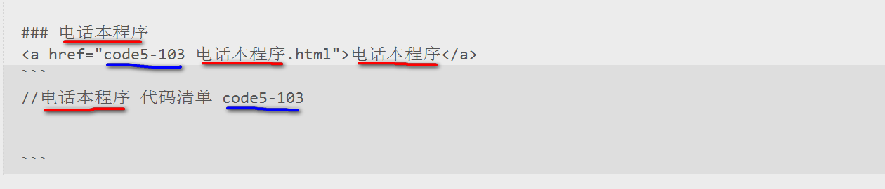
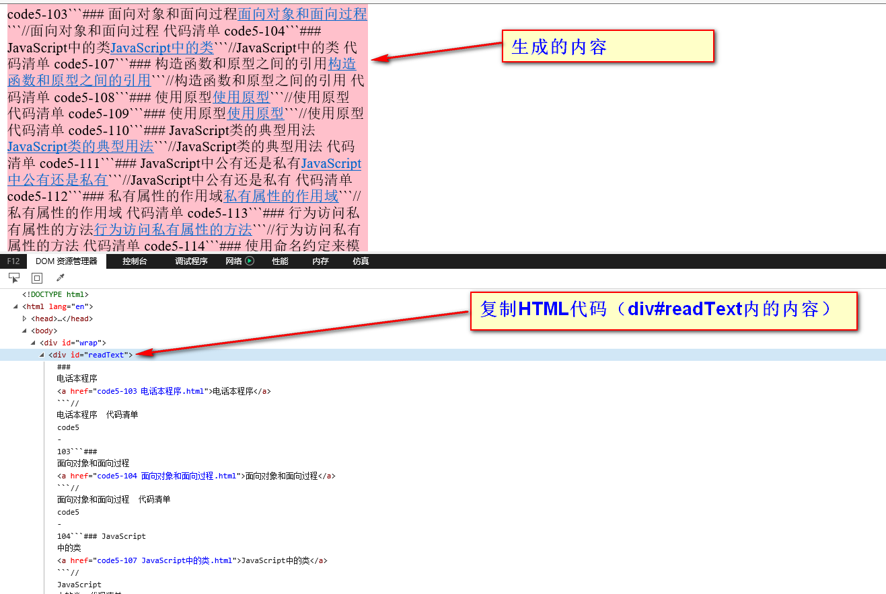

# 批量提取文件夹内文件名方法 

- 新建文本文档.bat（code文件夹）
- LIST.TXT（双击上述文件后code文件夹内生成的文件）
- 读取文件名.html（需要编写代码读取“新建文本文档.bat”内的内容，并做一些处理）


## 一、制作.bat文件
1. 新建一个txt格式的记事本
2. 记事本中输入```DIR *.*  /B >LIST.TXT```
3. 记事本文件后缀名，有txt改为bat
4. 双击文件“新建文本文档.bat”即可生成list.txt文件。
打开txt文件即可看到当前文件夹内的所有文件名列表。
**注：**也可以把文件“新建文本文档.bat”放在其他文件夹里运行，获取当前文件夹下面的所有文件名
## 二、 读取list.txt文件内内容代码

```
// 原始代码
    var fso, ts, s;
    var ForReading = 1;

    fso = new ActiveXObject('Scripting.FileSystemObject');
    ts = fso.OpenTextFile('LIST.TXT', ForReading);
    s = ts.ReadLine();
    document.getElementById('readText').innerHTML = s;
```



需要生成图示格式内容，对上述代码进行修改：
```
// 读取文件代码
    var fso, ts, s;
    var ForReading = 1;
    var arr = [];
    var readText = document.getElementById('readText');
    var wrap = document.getElementById('wrap');
    fso = new ActiveXObject('Scripting.FileSystemObject');

    // fso.OpenTextFile(在电脑上的位置, ForReading)
    ts = fso.OpenTextFile('H:LIST.TXT', ForReading);
    s = ts.ReadAll();
    // document.getElementById('readText').innerHTML = s;
    // alert(s);

    // 将生成的字符串文件名分隔成数组
    arr = s.split('.html');
    var html = '';
    for(var i = 0; i < arr.length - 1; i++) {

        html += '### ' + arr[i].split(' ')[1] + "<a href = " + '"' + arr[i].toString().replace(/^\s*/g, '') + '.html' + '"' + '>' + arr[i].split(' ')[1] + "</a>```" 
         + "//" + arr[i].split(' ')[1] + "  代码清单  " + arr[i].split(' ')[0] + "```";
    }
    // 将生成的内容输出到页面
    readText.innerHTML = html;


</script>
```
注：
1. str.replace(/^\s*/g, '');  去除前面的空格
2. 关于Windows系统，文件路径，比如```'H: images\LIST.TXT'```，是双反斜杠，应为```'H: images\\LIST.TXT'```

## 三、 读取list.txt文件内内容
代码OK后，在IE浏览器下打开“读取文件名.html”文件，====>F12。

复制div#readText内的内容，然后进行格式化（在线格式化工具如下链接）即可。


参考文章：

- <a href="https://wenku.baidu.com/view/a943d50ad5bbfd0a7856734b.html">超级简单的批量提取文件夹内文件名的经典方法</a>
- <a href="http://www.jb51.net/article/46712.htm">Javascript写入txt和读取txt文件示例</a>
- <a href="http://tool.chinaz.com/Tools/jsformat.aspx">代码格式化</a>


